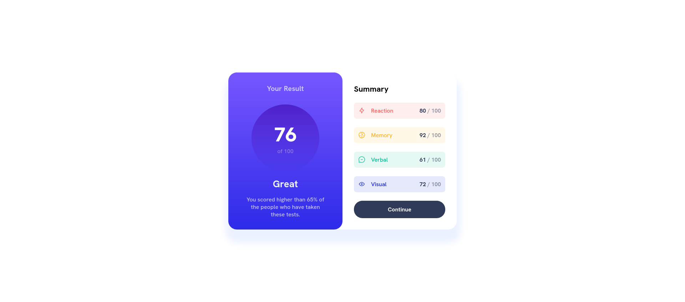

# Frontend Mentor - Results summary component solution

This is a solution to the [Results summary component challenge on Frontend Mentor](https://www.frontendmentor.io/challenges/results-summary-component-CE_K6s0maV). Frontend Mentor challenges help you improve your coding skills by building realistic projects.

## Table of contents

- [Overview](#overview)
  - [Screenshot](#screenshot)
  - [Links](#links)
- [Built with](#built-with)
- [Author](#author)

## Overview

A very good looking card component, which shows the results of a test, along with the summary for the different categories.

Even though the project doesn't require states or other specific features of React, I still tried building it using React JS, for practice purposes. I got a better understanding of components and using JSON data.

### Screenshot

### Links

- Solution URL: [https://www.frontendmentor.io/solutions/results-summary-component-using-react--D0BpXP6p7](https://www.frontendmentor.io/solutions/results-summary-component-using-react--D0BpXP6p7)
- Live Site URL: [https://adrianfloroiu.github.io/results-summary-component/](https://adrianfloroiu.github.io/results-summary-component/)

## Built with

- React
- HTML5
- CSS
- Flexbox

## Author

- Frontend Mentor - [@adrianfloroiu](https://www.frontendmentor.io/profile/adrianfloroiu)
